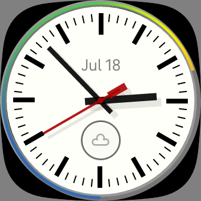
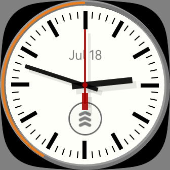
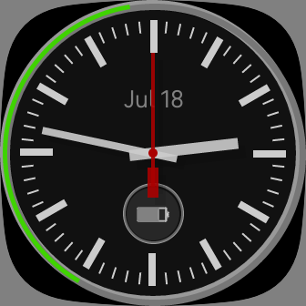

# Tracks

## Analog clock with sensor info for Fitbit Versa 3 and Sense
### [Get this clock face from the Fitbit Gallery](https://gallery.fitbit.com/details/5b532c82-5211-4b7f-a0b2-a09d02f5a42e)
Inspired by some of the classic modern railway clocks, this is an analog clock with sensor information, plus date and weather. Included sensors are: 
+ Battery
+ Heart Rate
+ Steps
+ Distance
+ Floors
+ Calories
+ Active Zone Minutes

Tapping the icon in the lower part of the clock face cycles between the different sensors. For the Weather display, the hour markers indicate the temperature shown by the colored outer ring in increments of 10F, from 0F to 120F. For Heart Rate, the hour markers indicate increments of 20bpm, from 20bpm to 220bpm. For all other sensors, each hour marker indicates 10% of the goal, or 10% of the battery level. 

Tapping the clock face outside of the icon toggles dark mode on an off.

Code is present to support Always On Displays, but the necessary permissions are not currently enabled.

This clock has only been tested on Fitbit Versa 3, so please feel free to submit a pull request with any improvements or bug fixes.